# Screenshots SIAKAD

Dokumentasi screenshot aplikasi SIAKAD berikut menampilkan tampilan utama dan fitur penting yang tersedia di sistem.

> Semua gambar berada di folder ini, sehingga Anda dapat membuka file-file PNG langsung dari folder `screenshots/`.

## Daftar Screenshot

### 1. `dashboard.png`
- Tampilan Dashboard utama setelah login.
- Menampilkan ringkasan statistik untuk jumlah dosen, mahasiswa, mata kuliah, jadwal, dan KRS.

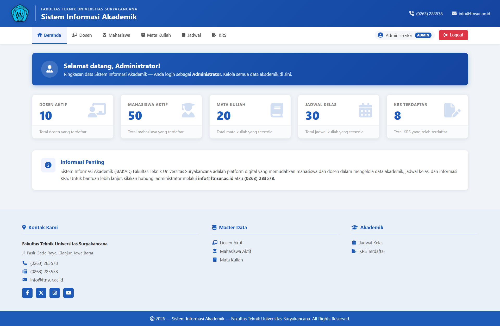

### 2. `dosen-index.png`
- Halaman daftar Dosen.
- Menampilkan tabel data dosen dengan fitur pencarian dan pengurutan.

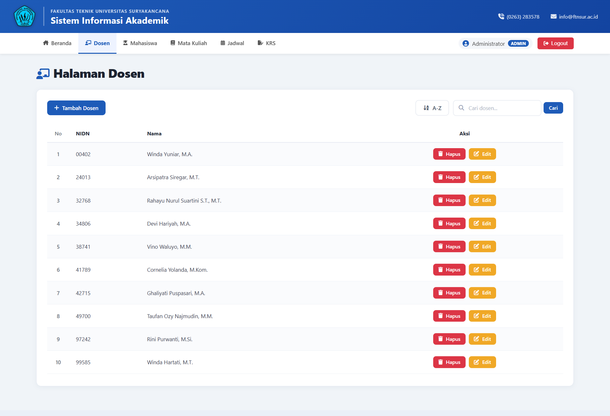

### 3. `dosen-create.png`
- Form tambah data Dosen baru.
- Menampilkan input NIDN dan nama dosen beserta validasi.

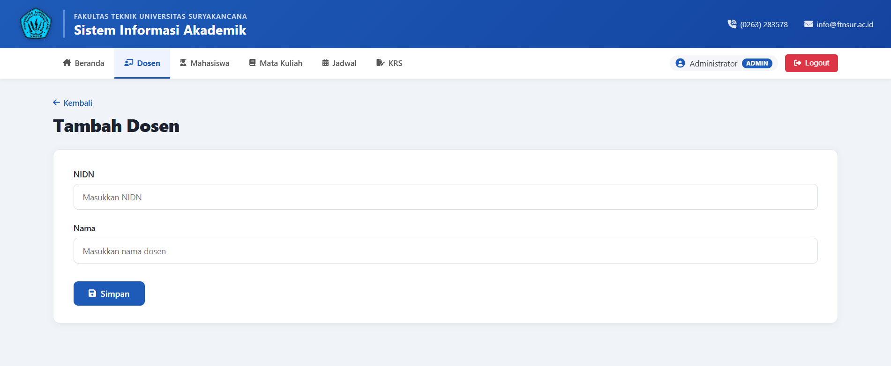

### 4. `mahasiswa-index.png`
- Halaman daftar Mahasiswa.
- Menampilkan tabel data mahasiswa, dosen wali, serta kontrol pencarian dan pengurutan.

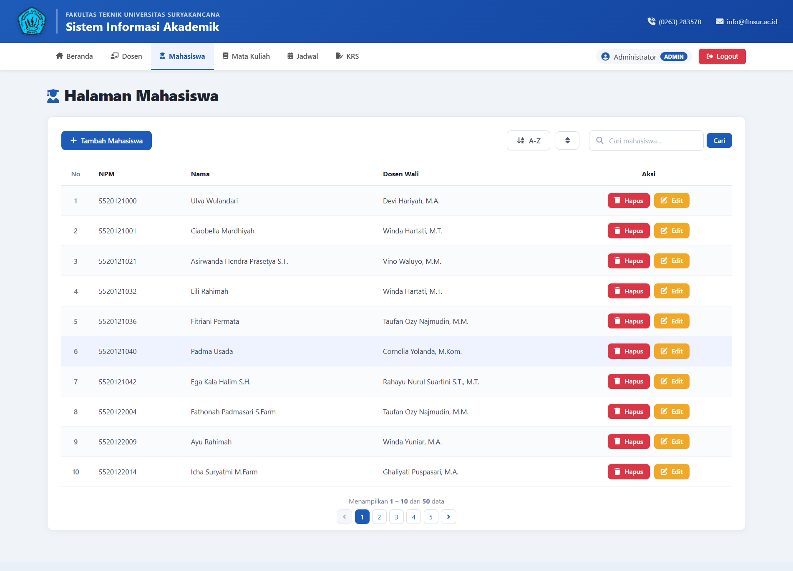

### 5. `mahasiswa-create.png`
- Form tambah Mahasiswa baru.
- Termasuk input NPM, nama, dosen wali, dan akun login mahasiswa.

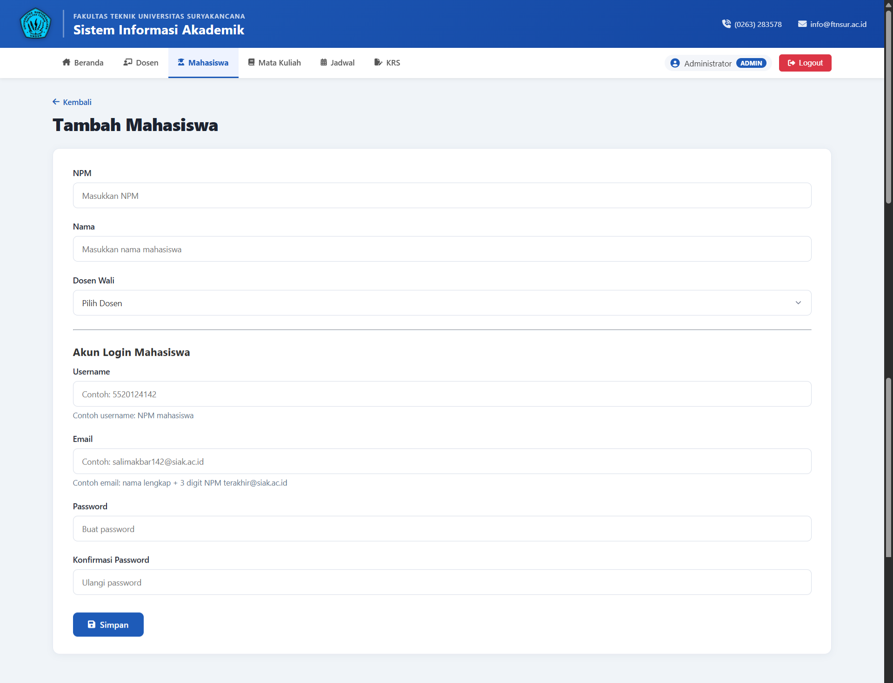

### 6. `matakuliah-index.png`
- Halaman daftar Mata Kuliah.
- Menampilkan kode, nama, dan SKS mata kuliah dengan pencarian dan urutan.

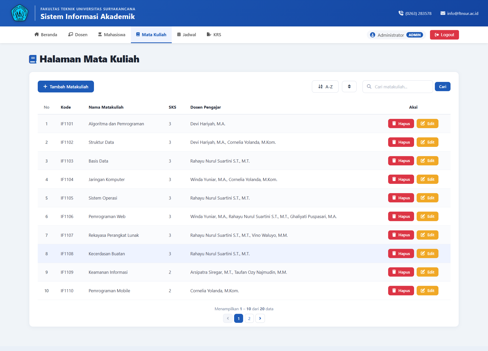

### 7. `matakuliah-create.png`
- Form tambah Mata Kuliah baru.
- Menampilkan input kode mata kuliah, nama, dan jumlah SKS.

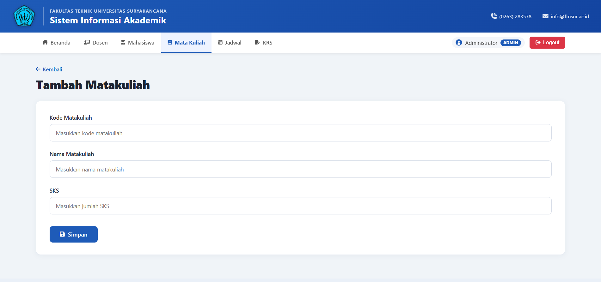

### 8. `jadwal-index.png`
- Halaman daftar Jadwal Perkuliahan.
- Menampilkan jadwal kelas, mata kuliah, dosen, hari, dan waktu.

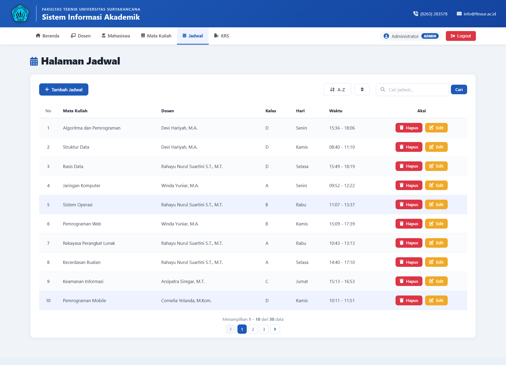

### 9. `jadwal-create.png`
- Form tambah Jadwal Perkuliahan baru.
- Menampilkan input pemilihan mata kuliah, dosen, kelas, hari, dan jam.

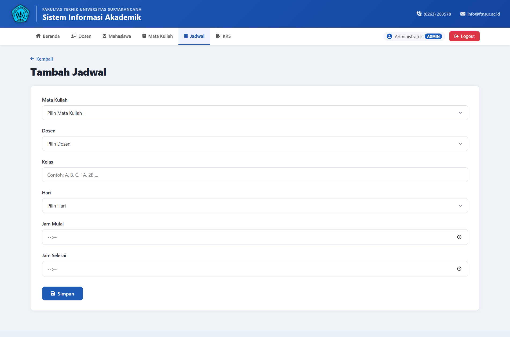

### 10. `krs-index.png`
- Halaman KRS untuk melihat dan mengelola Kartu Rencana Studi.
- Menampilkan daftar mata kuliah yang diambil, serta kontrol penghapusan untuk mahasiswa.

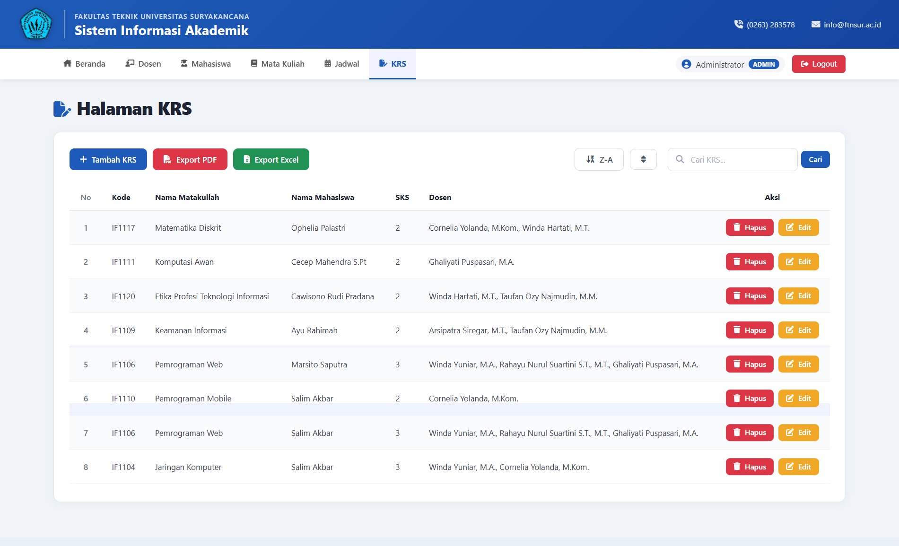

### 11. `krs-create.png`
- Form tambah KRS baru.
- Menampilkan pilihan mata kuliah yang dapat ditambahkan ke KRS.

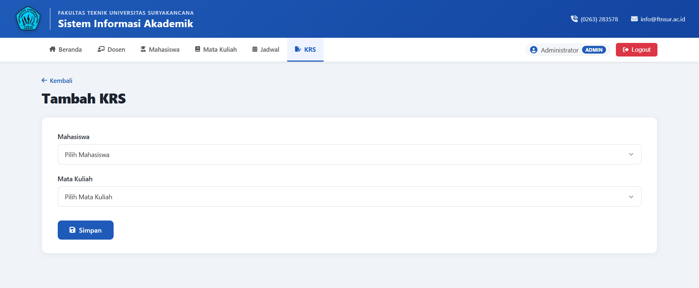

### 12. `ERD_SIAKAD.png`
- Diagram Entity Relationship Database untuk aplikasi SIAKAD.
- Menampilkan relasi antar tabel seperti dosen, mahasiswa, matakuliah, jadwal, dan KRS.

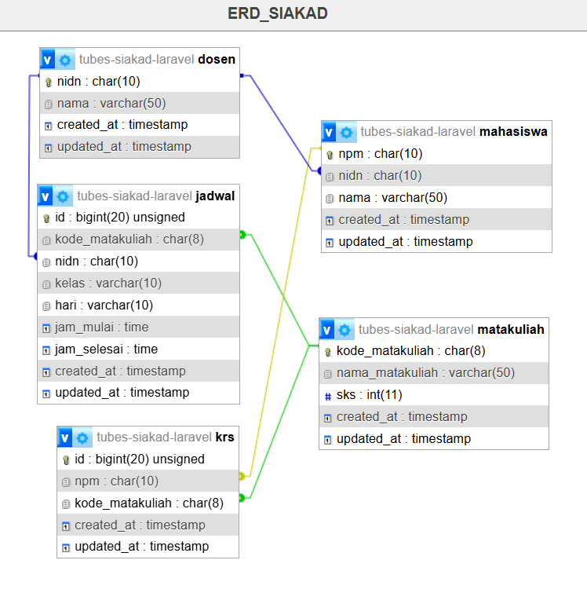

---